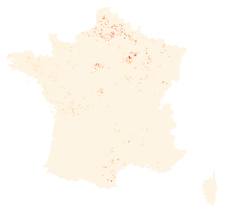

# fr-turbines-installed-capacity

## Content

### density.tif

Direct download : https://energyexplorer.s3.fr-par.scw.cloud/density.2e03a95d4b2c2e7b698314a47353d8f6b2eb11e48c83a4a1385f5d491e88cf18.tif

**Density of wind power production capacity**



Unit: maximum installed production capacity, in kW / m2

Projection: Lambert-93

Source: [Registre national des installations de production et de stockage d'électricité (31/10/2022)](https://odre.opendatasoft.com/explore/dataset/registre-national-installation-production-stockage-electricite-agrege/information) / ODRÉ

## Methodology

Methodology: see src/README.md

## .DOWNLOAD_ME files

The large files are stored outside this repository. They are replaced by a ".DOWNLOAD_ME" file containing their URL.

To easily retrieve all files at once, you can use the `./download.sh` utility from the [energyexplorer-datasets/common](https://github.com/energyexplorer-datasets/common) repository.

```
git clone https://github.com/energyexplorer-datasets/common.git
git clone https://github.com/energyexplorer-datasets/fr-turbines-installed-capacity.git
cd fr-turbines-installed-capacity
../common/download.sh
```

You can have the new or updated files automatically downloaded when you do a `git pull`. For that, add a hook to your git repository:
```
cd fr-solar-installed-capacity # if not already here
echo -e '#!/bin/sh\nexec ../common/download.sh' >> .git/hooks/post-merge
chmod +x .git/hooks/post-merge
```

## License

Data: Licence Ouverte

Code: MIT
